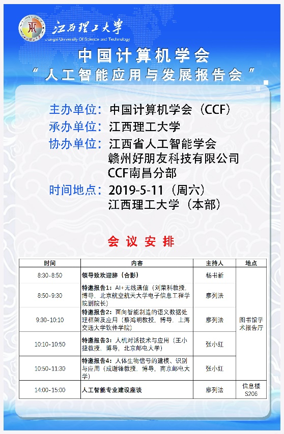
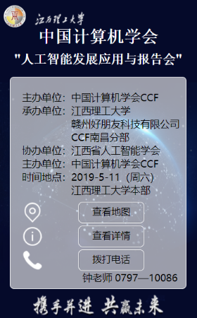
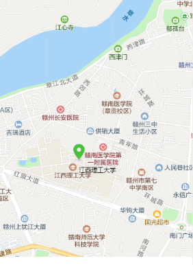
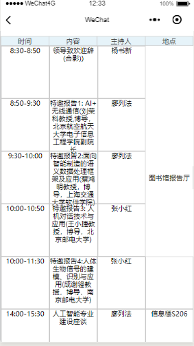
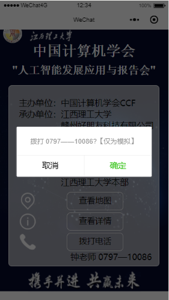

​理解经纬度坐标的含义、 掌握位置和地图控制等系列接口的用法、利用所学知识制作会议邀请函小程序。

根据素材中的“中国计算机学会”人工智能应用与发展报告会海报制作一个简易的会议邀请函小程序。要求页面提供海报中相关的会议信息，包括会议名称、会议介绍、会议安排、会议时间、会议地点等，并提供联系方式：钟老师 0797—10086（点击可拨打电话）；小地图显示会议地点并定位标记xxxx大学。

​

实现效果如下：

​

​

​

